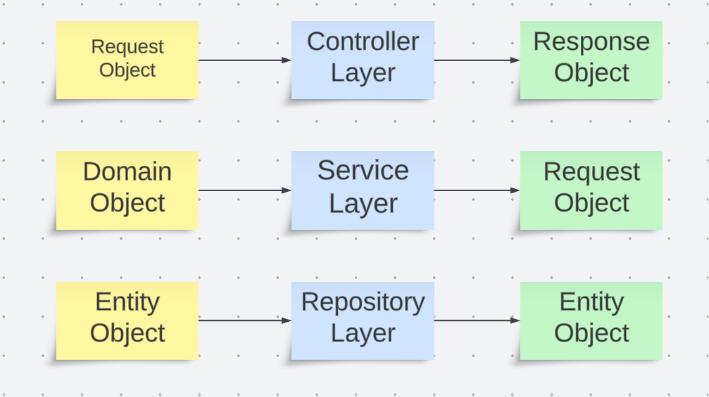

# IoT Device Stock and Warranty Tracking System

This project aims to develop a Java Spring Boot application that manages the stock and warranty tracking of IoT devices. The application stores device information and checks the warranty status of devices.
## Project Details

Device Information: Stores serial number, brand, and model information of devices.
Warranty Check: Checks the warranty status of devices. The standard warranty period is 2 years from the purchase date. Devices with expired warranties are marked as "Warranty Expired".

## Tech Stack

**Framework**

* Core
    * Spring
        * Spring Boot 3
        * Spring Boot Test (Junit)
        * Spring Boot Dev Tools
        * Spring Web
   * Spring Data
        * Spring Data JPA    

**3rd Party Dependencies**
* Lombok
* Test Containers
* Mapstruct

**Database**

* PostgreSql

**Database Migration Tool**

* FlyWay

**Language**

* Java 17

**Build Tool**

* Maven
  
**Version Control**

* Git
* GitHub


# Getting Started

The project has been generated by Spring Initializer.
Clone the project files to your computer:

```bash
git clone https://github.com/username/project-name.git

```

## Requirements

You will need the following requirements to run this project:

- Java 17+
- Maven
- PostgreSQL database
- Run the application:

```bash
./mvnw spring-boot:run
```

Now your application should be running at http://localhost:8080.

## Used Technologies
- Java 17
- Spring Boot Latest
- Maven Latest
- Spring Data JPA
- FlyWay
- PostgreSQL Latest
- Mapstruct
- Lombok
- JUnit
- Docker
- Testcontainers

# Installation with Docker
Follow the steps below to run the project using Docker.

- Start PostgreSQL on Docker:
   ```bash
  docker run --name postgres -e POSTGRES_PASSWORD=yourpassword -d -p 5432:5432 postgres

  ```

- Run the application inside Docker:

  ```bash
  docker build -t iot-device-management .
  docker run -p 8080:8080 --name iot-device-management --link postgres:postgres -d iot-device-management

  ```


# Database Management
The project uses Flyway for database management. Changes made are automatically applied and can be rolled back. Flyway provides version control of the database schema and keeps the application's database version up to date.

```bash
> mvn flyway:migrate -Dflyway.url=... -Dflyway.user=... -Dflyway.password=...
```

# Test

There are unit tests in the project using JUnit and Mockito. You can use the following command to run the tests:

```bash
./mvnw test
```


# Postman API Collection

You can use the Postman API collection to test the project. You can download the Postman collection by following the steps below:
- [Postman API Collection](https://www.postman.com/altimetry-physicist-64740135/workspace/restaurant-management/overview)

- Download the collection file by clicking the link.
- Open the Postman application.
- Click the 'Import' button in the top left corner.
- Select 'Import From Link' option and paste the collection link you downloaded.
- Click the 'Import' button to import the collection.
- You can now test the API by sending various requests in Postman.

# Project Infrastucture



